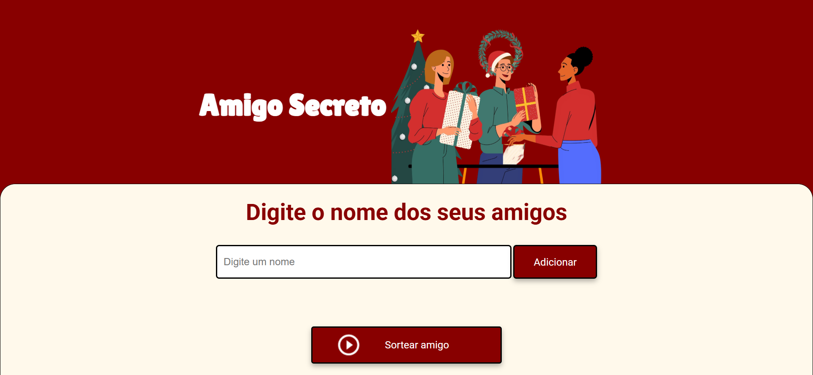
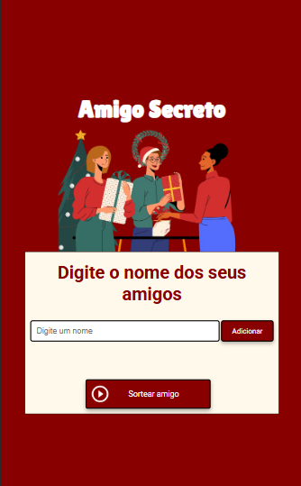

# Amigo Secreto - Challenge ONE G8
 <p>
    
    
 </p>
Este projeto faz parte do Challenge ONE do grupo G8 e tem como objetivo criar uma aplicação web para realizar sorteios de amigo secreto. 

## 🚀 Sobre o Projeto

A aplicação permite que os usuários adicionem participantes, visualizem a lista de amigos cadastrados e realizem o sorteio de forma dinâmica e intuitiva. Além disso, a interface foi desenvolvida para ser responsiva e adaptável a dispositivos móveis, garantindo uma experiência fluida em qualquer tela.

## 🔍 Como Funciona?

1. O usuário digita o nome de um participante no campo de entrada.
2. O nome é adicionado à lista de participantes exibida na tela.
3. O usuário pode remover nomes da lista caso tenha digitado errado ou queira excluir alguém.
4. Quando a lista tiver pelo menos três participantes, o usuário pode realizar o sorteio.
5. O sistema sorteará aleatoriamente os amigos secretos e mostrará o resultado.

## ⚠️ Validações e Tratamento de Erros

- **Mínimo de Participantes**: Se o usuário tentar sortear com menos de três participantes, um alerta será exibido informando que o mínimo necessário são três nomes.
- **Nome Inválido**: Se o usuário tentar adicionar um campo vazio, será exibida a mensagem "Por favor, digite um nome válido".
- **Sorteio Finalizado**: Caso todos os nomes da lista já tenham sido sorteados, a aplicação impedirá novos sorteios para evitar repetições.

## 📱 Responsividade

O projeto foi desenvolvido com um design responsivo, garantindo uma experiência otimizada para dispositivos móveis, tablets e desktops.

## 🛠️ Tecnologias Utilizadas

- **HTML**
- **CSS** (para estilização responsiva)
- **JavaScript** (para lógica de sorteio e interatividade)

## 🎯 Objetivo do Challenge

Este projeto foi desenvolvido como parte do **Challenge ONE** do grupo G8, com o intuito de colocar em prática o aprendizado de lógica de programação. Durante o desenvolvimento, foram aplicados conceitos fundamentais como variáveis, condicionais, funções, listas e loops de repetição.

## 📸 Prévia do Projeto


## 🎮 Acesse o Projeto Online

Você pode testar o projeto diretamente através do link abaixo:

[🔗 Amigo Secreto - Challenge ONE G8](https://challenge-amigo-secreto-eight-kohl.vercel.app/)


## 📌 Como Executar o Projeto

1. Clone este repositório para sua máquina:
   ```bash
   git clone https://github.com/seu-usuario/nome-do-repositorio.git
   ```
2. Navegue até a pasta do projeto:
   ```bash
   cd nome-do-repositorio
   ```
3. Abra o arquivo `index.html` em um navegador.
4. Adicione os participantes e realize o sorteio!

---

Desenvolvido por **Stéfany Cristina** 🚀


